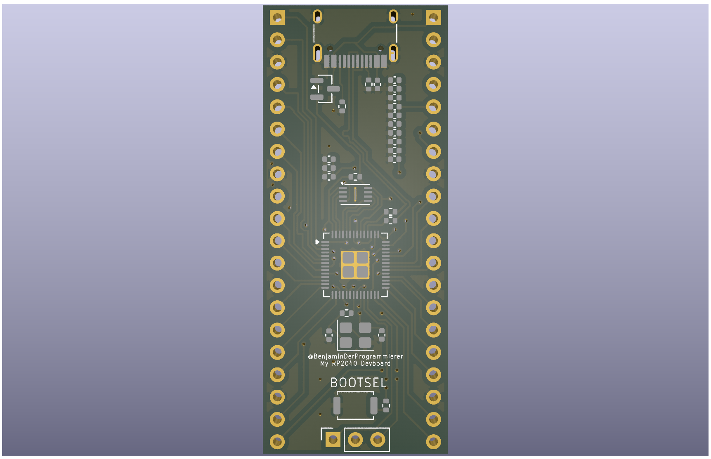
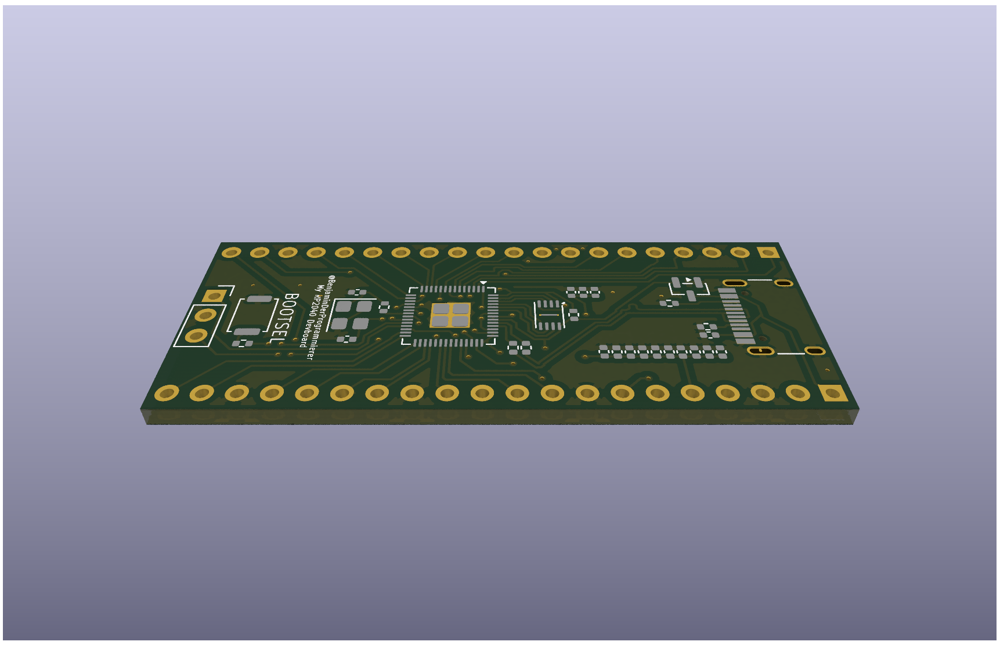
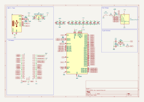
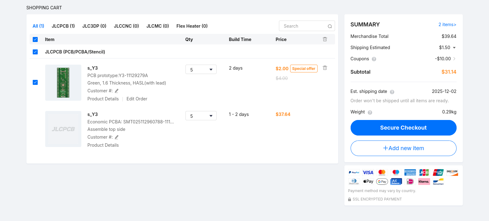

# RP2040 Dev Board

My take on the RP2040 Dev Board (See [guide](https://blueprint.hackclub.com/starter-projects/devboard))

## Why?

I wanted to progress my ESP32 Dev Board, but I had little experience with PCBs. So, I decided to start with the RP2040, which seemed easier, following the guide.

## A few images

## Bill of Materials (BOM)

| Qty | Description |
| ---: | --- |
| 1 | USB‑C receptacle (USB2.0) |
| 2 | 27 Ω 0402 resistor |
| 4 | 1 µF 0402 capacitor |
| 10 | 0.1 µF 0402 capacitor |
| 1 | 3‑pin 2.54 mm vertical pin header |
| 2 | 5.1 kΩ 0402 resistor |
| 2 | 1 kΩ 0402 resistor |
| 1 | MCP1700 3.3V LDO regulator (SOT‑23) |
| 1 | W25Q16 16Mbit SPI flash (USON‑8) |
| 1 | 10 kΩ 0402 resistor |
| 2 | 20‑pin 2.54 mm vertical pin headers |
| 1 | RP2040 microcontroller (QFN‑56) |
| 2 | 33 pF 0402 capacitor |
| 1 | 12 MHz SMD crystal (3225) |
| 1 | Push button (SPST, momentary) |
